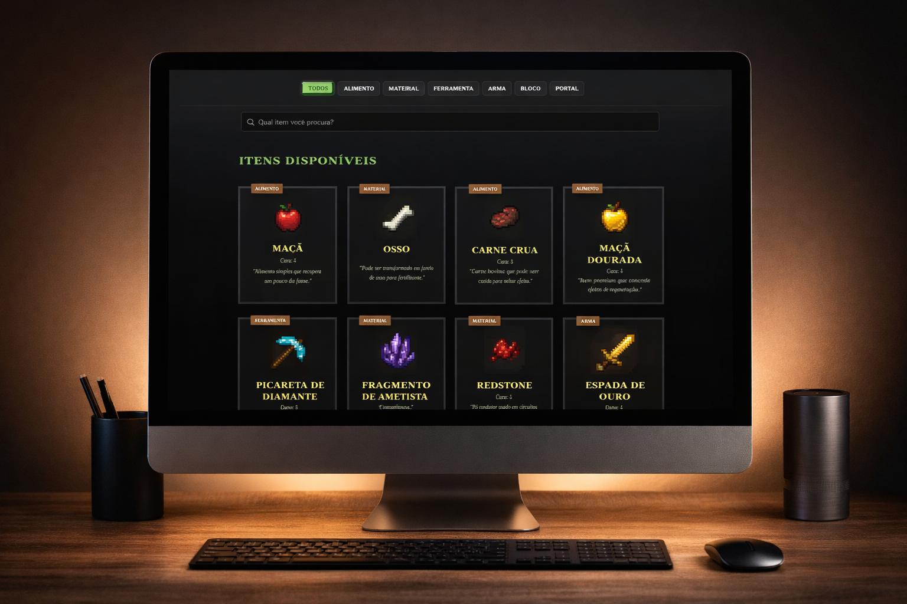
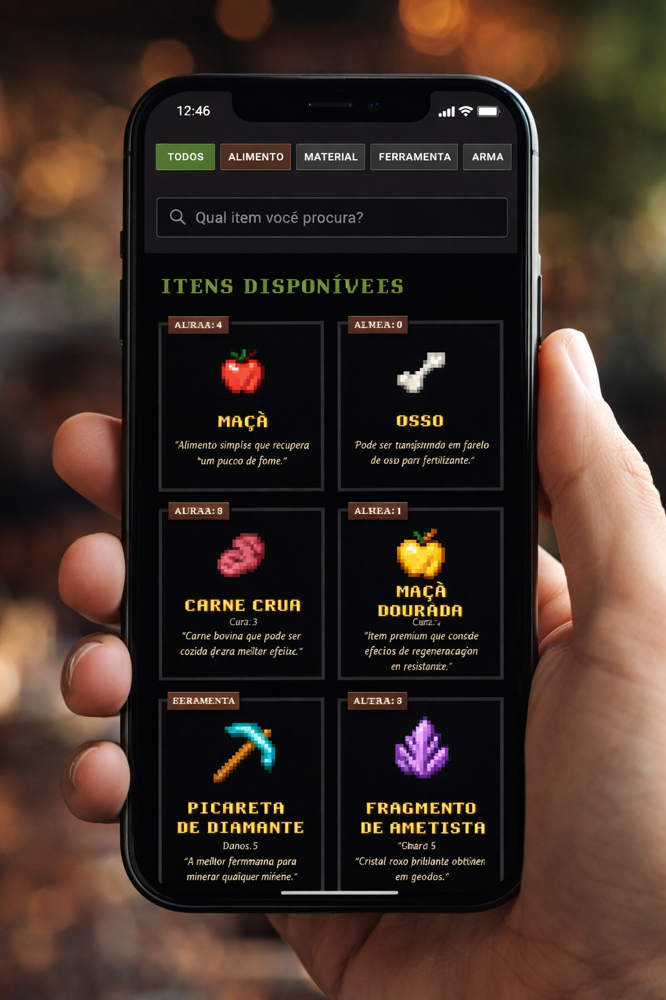

# Projeto React Minecraft

Bem-vindo ao **Projeto React Minecraft**! Este é um aplicativo web interativo desenvolvido com React que simula uma loja de itens do universo Minecraft. Ele permite aos usuários visualizar, filtrar e buscar itens, proporcionando uma experiência de navegação fluida e responsiva.

## Visão Geral do Projeto

O objetivo deste projeto é demonstrar habilidades em desenvolvimento front-end utilizando React, gerenciamento de estado, componentes reutilizáveis e estilização moderna com TailwindCSS. A aplicação apresenta uma interface intuitiva onde os itens são categorizados e podem ser facilmente encontrados através de uma barra de busca.

## Screenshots

### Desktop



### Mobile



## Tecnologias Utilizadas

*   **React**: Biblioteca JavaScript para construção de interfaces de usuário.
*   **Vite**: Ferramenta de build rápida para projetos web modernos.
*   **TailwindCSS**: Framework CSS utilitário para estilização rápida e responsiva.
*   **JavaScript (ES6+)**: Linguagem de programação principal.
*   **HTML5/CSS3**: Estrutura e estilização básica.

## Funcionalidades

*   **Listagem de Itens**: Exibe uma variedade de itens do Minecraft com suas descrições e atributos.
*   **Filtro por Categoria**: Permite filtrar itens por categorias como 'Alimento', 'Material', 'Ferramenta', 'Arma', 'Bloco' e 'Portal'.
*   **Barra de Busca**: Funcionalidade de busca para encontrar itens específicos pelo nome.
*   **Design Responsivo**: Interface adaptável a diferentes tamanhos de tela, de desktops a dispositivos móveis.

## Como Rodar o Projeto Localmente

Siga os passos abaixo para configurar e executar o projeto em sua máquina local:

### Pré-requisitos

Certifique-se de ter o [Node.js](https://nodejs.org/) e o [npm](https://www.npmjs.com/) (ou Yarn) instalados em seu sistema.

### Instalação

1.  **Clone o repositório:**

    ```bash
    git clone https://github.com/camilyolivei/trabalho-react-minecraft.git
    ```

2.  **Navegue até o diretório do projeto:**

    ```bash
    cd trabalho-react-minecraft
    ```

3.  **Instale as dependências:**

    ```bash
    npm install
    # ou yarn install
    ```

### Execução

1.  **Inicie o servidor de desenvolvimento:**

    ```bash
    npm run dev
    # ou yarn dev
    ```

2.  **Acesse o aplicativo:**

    Abra seu navegador e navegue para `http://localhost:5173` (ou a porta indicada pelo Vite, caso a 5173 esteja em uso).

## Estrutura do Projeto

```
trabalho-react-minecraft/
├── public/
├── src/
│   ├── assets/
│   │   ├── imagens/ # Imagens dos itens
│   │   └── style.css # Estilos globais
│   ├── components/ # Componentes React reutilizáveis
│   │   ├── busca/
│   │   ├── buscaCategoria/
│   │   ├── cards/
│   │   ├── categoria/
│   │   ├── conteudoDaLoja/
│   │   ├── menuSuperior/
│   │   └── rodape/
│   ├── data/ # Dados mockados dos itens
│   │   └── data.js
│   ├── App.jsx # Componente principal da aplicação
│   └── main.jsx # Ponto de entrada da aplicação
├── .gitignore
├── index.html
├── package.json
├── vite.config.js
└── README.md
```

## Responsividade

O projeto foi desenvolvido com uma abordagem **mobile-first**, garantindo que a interface se adapte perfeitamente a qualquer tamanho de tela, desde smartphones até monitores de desktop. A utilização do TailwindCSS facilitou a implementação de um design flexível e otimizado para diversas resoluções.

## Contribuição

Contribuições são bem-vindas! Sinta-se à vontade para abrir issues ou pull requests para melhorias e novas funcionalidades.

---

**Desenvolvido com ❤️ por Camily Oliveira**
